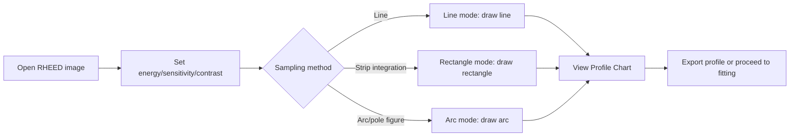
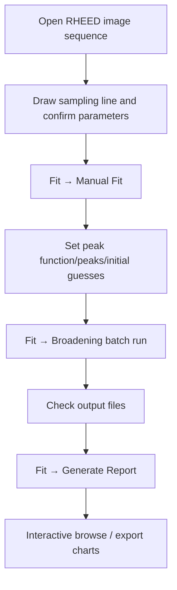
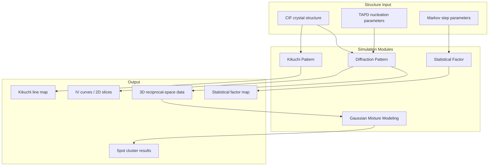

# PyRHEED Detailed Tutorial and Workflows

Language links: [English](TUTORIAL_en.md) | [中文](TUTORIAL_zh.md)

This document describes the PyRHEED user interface layout, typical analysis workflows, scenario batch-processing configuration, and how to use the theoretical simulation modules.

---

## Table of Contents

1. [Quick Start](#1-quick-start)
2. [Main Interface Overview](#2-main-interface-overview)
3. [Workflow A: Experimental RHEED Image Analysis](#3-workflow-a-experimental-rheed-image-analysis)
4. [Workflow B: Reciprocal Space Mapping (RSM)](#4-workflow-b-reciprocal-space-mapping-rsm)
5. [Workflow C: Line Profile Fitting and Reports](#5-workflow-c-line-profile-fitting-and-reports)
6. [Workflow D: Scenario Batch Processing](#6-workflow-d-scenario-batch-processing)
7. [Workflow E: Theoretical Simulation](#7-workflow-e-theoretical-simulation)
8. [Configuration Files](#8-configuration-files)
9. [Frequently Asked Questions](#9-frequently-asked-questions)

---

## 1. Quick Start

### 1.1 Installation

```bash
# Install uv (if not already installed)
# Windows (PowerShell):
powershell -ExecutionPolicy ByPass -c "irm https://astral.sh/uv/install.ps1 | iex"

# Clone and install dependencies
git clone https://github.com/JMjimike/PyRHEED.git
cd PyRHEED
uv sync
```

### 1.2 Launch

```bash
uv run src/main.py
```

The application starts in a maximized window. On first use, open **Preference → Default Settings** to confirm that electron energy, sensitivity, and other parameters match your RHEED instrument.

### 1.3 Supported Image Formats

| Format | Description |
|--------|-------------|
| RAW | Camera raw format, read via rawpy; recommended for high dynamic range data |
| TIFF / PNG | General formats, suitable for 16-bit grayscale images |
| JPEG | 8-bit only, limited dynamic range; not recommended for quantitative analysis |

---

## 2. Main Interface Overview

### 2.1 Menu Bar

| Menu | Function |
|------|----------|
| **File → Open** | Open RHEED images |
| **File → Export** | Export RHEED patterns, line profiles (text/image/SVG) |
| **Preference → Default Settings** | Modify default physical parameters and display settings |
| **Mapping → Configuration** | Reciprocal space mapping configuration |
| **Mapping → 3D Surface** | Three-dimensional reciprocal space surface |
| **Fit → Broadening** | Batch line profile fitting (broadening analysis) |
| **Fit → Manual Fit** | Manual fitting to initialize parameters |
| **Fit → Generate Report** | Generate interactive report of fitting results |
| **Fit → Gaussian Mixture Modeling** | Gaussian mixture model analysis |
| **Simulation → Statistical Factor** | Statistical factor simulation |
| **Simulation → Diffraction Pattern** | Kinematic diffraction pattern simulation |
| **Simulation → Kikuchi Pattern** | Kikuchi line simulation |
| **Run → Run Scenario** | Open scenario batch-processing window |

### 2.2 Toolbar

| Tool | Purpose |
|------|---------|
| Open / Save | Load images, export current canvas |
| Line | Extract intensity profile along a straight line |
| Rectangle | Integrate over a rectangular region to extract a profile |
| Arc | Extract profile along an arc (for pole figures / azimuth scans) |
| Pan | Drag the canvas |
| Zoom +/- | Zoom in / out |
| Fit to canvas | Auto-scale to an appropriate size |
| Dark / Light mode | Switch interface theme |

### 2.3 Right-Side Properties Panel

You can adjust the following in real time:

- **Sensitivity**: Conversion factor between pixels and reciprocal-space coordinates
- **Electron Energy (keV)**
- **Azimuth**
- **Brightness / Black Level**: Image contrast
- **Integral Half Width**: Half-width for rectangle/arc integration
- **Chi Range / Radius / Tilt Angle**: Parameters related to RSM and spherical mapping

After changes, images and profiles in the current tab update immediately.

### 2.4 Multiple Tabs

Each opened image creates a new tab. You can switch between different samples or scan sequences; each tab independently retains drawn shapes and analysis state.

---

## 3. Workflow A: Experimental RHEED Image Analysis

**Use case:** Single or a few RHEED images; quickly inspect diffraction spot positions and extract line profiles.

```
Open image → Adjust display → Draw sampling line → View/export profile
```

### Step-by-Step

**Step 1 — Open Image**

- Menu **File → Open**, or the toolbar **Open** button
- Select RAW / TIFF / PNG or other files
- The image is automatically converted to grayscale for display

**Step 2 — Adjust Display Parameters**

- In the right-side properties panel, adjust **Brightness** and **Black Level** so diffraction spots are clearly visible
- Set **Electron Energy** and **Sensitivity** (must match experimental calibration)
- Use toolbar zoom and pan to locate regions of interest

**Step 3 — Extract Line Profile**

1. Click toolbar **Line** (line mode)
2. Click the start point on the image, drag to the end point, release the mouse
3. The **Profile Chart** below shows intensity vs. position (or reciprocal coordinates) in real time
4. To integrate over a strip region, switch to **Rectangle** mode and set **Integral Half Width**

**Step 4 — Export Results**

- **File → Export → Line profile as text**: Save numerical data (for external fitting)
- **File → Export → Line profile as image / SVG**: Save profile plot
- **File → Export → RHEED pattern as Image**: Save current canvas screenshot

### Workflow Diagram



---

## 4. Workflow B: Reciprocal Space Mapping (RSM)

**Use case:** A series of RHEED images scanned by azimuth angle φ or tilt angle χ; build 2D/3D reciprocal space maps or pole figures.

```
Prepare image sequence → Mapping configuration → Generate 2D/3D map → Optional ParaView post-processing
```

### Prerequisites

- Store scan images in the same directory with sequential filenames (e.g. `0001.tif`, `0002.tif`, …)
- Know the azimuth or tilt step for each image
- Correctly set **Sensitivity** and **Electron Energy** in the main window properties panel

### Step-by-Step

**Step 1 — Open Any Image from the Sequence**

First open any image in the directory via **File → Open** so the program knows the data path.

**Step 2 — Open Mapping Configuration**

Menu **Mapping → Configuration**

**Step 3 — Configure Parameters**

In the mapping dialog, set:

| Parameter | Meaning |
|-----------|---------|
| Source Directory | Folder containing the image sequence |
| Start / End Index | Index range of images included in the map |
| Range | Reciprocal-space range for profile extraction on each image |
| Normalization | Whether to normalize intensity |

Depending on scan type:

- **Azimuth scan (φ-scan):** Extract along an arc (Arc mode) or vertically to build `(K∥, φ)` or `(Kx, Ky)` maps
- **Vertical scan (χ-scan / IV):** Extract vertically to build `(K∥, K⊥)` maps

**Step 4 — Run and View**

- Click Run; the program batch-processes the image sequence
- A 2D reciprocal space map is generated; view the 3D surface via **Mapping → 3D Surface**
- 3D data can be exported as **.vtp** and opened in ParaView for further rendering

### Typical Directory Structure

```
my_rheed_scan/
├── 0000.tif    # φ = 0°
├── 0001.tif    # φ = 1°
├── 0002.tif    # φ = 2°
└── ...
```

---

## 5. Workflow C: Line Profile Fitting and Reports

**Use case:** Batch extraction of peak positions, broadening (FWHM), and other quantitative parameters from a series of RHEED images.

```
Manual Fit initialization → Broadening batch fitting → Generate Report visualization
```

### 5.1 Manual Fit

**Purpose:** Determine reasonable initial guesses for peak shape functions before batch processing.

1. Open an image and draw a sampling line on the canvas
2. Menu **Fit → Manual Fit**
3. Select peak function type (Gaussian, Voigt, etc.)
4. Set number of peaks and background options
5. Interactively adjust parameters and observe fit vs. experimental curve
6. After confirmation, use these parameters as initial values for the Broadening module

### 5.2 Batch Broadening Fit (Broadening)

1. Menu **Fit → Broadening**
2. Configure:
   - **Source Directory**: Image sequence directory
   - **Start / End Index**: Processing range
   - **Number of Steps**: Number of parallel scans along the sampling line (for statistics over multiple profiles)
   - **Fit Function**: Gaussian / Voigt, etc.
   - **Number of Peaks**: Peaks per profile
   - **Tolerance** (ftol, xtol, gtol): Fitting convergence thresholds
3. Click Run; progress bar shows processing status
4. Results are written to the destination directory (default: same as source), typically text or table format with peak position, intensity, broadening, etc.

### 5.3 Generate Report

1. Menu **Fit → Generate Report**
2. Select Broadening output file or directory
3. The program generates interactive charts to browse fitting results at each scan angle
4. Supports image export for papers or reports

### Complete Fitting Workflow



---

## 6. Workflow D: Scenario Batch Processing

**Use case:** Repeatedly run combined tasks such as "diffraction simulation + TAPD statistics + broadening fit + report generation" without manual step-by-step operation.

```
Edit default_scenario.ini → Run Scenario → Automatic output to destination directory
```

### 6.1 Open Scenario Window

Menu **Run → Run Scenario**

The window has two main tabs:

| Tab | Function |
|-----|----------|
| **CIF** | Simulate RHEED diffraction from CIF structure files (including IV curves, multilayer structures) |
| **TAPD** | Translational Antiphase Domain (TAPD) model simulation and domain boundary statistics |

### 6.2 Main CIF Scenario Parameters

| Parameter | Description |
|-----------|-------------|
| `cif_path` | Path to crystal structure CIF file |
| `destination` | Output directory for results |
| `h_range`, `k_range`, `l_range` | Reciprocal lattice range |
| `shape` / `lateral_size` | Simulation region shape and size |
| `z_min`, `z_max` | Vertical layer thickness range (comma-separated values for IV scans) |
| `number_of_k_para_steps` / `number_of_k_perp_steps` | Parallel/perpendicular reciprocal-space sampling steps |
| `kx/ky/kz_range_min/max` | Reciprocal-space scan range |
| `calculate_diffraction` | Whether to compute diffraction patterns |
| `save_iv_image` / `save_iv_data` | Whether to save IV images and data |

### 6.3 Main TAPD Scenario Parameters

| Parameter | Description |
|-----------|-------------|
| `epi_cif_path` / `sub_cif_path` | Epilayer / substrate CIF files |
| `x_max`, `y_max` | Simulation plane size (Å or nm, depending on configuration) |
| `density` | Domain density (comma-separated values for parameter scans) |
| `distribution` | Domain size distribution type (e.g. `completely random`) |
| `save_size_distribution` | Save domain size distribution |
| `save_boundary_statistics` | Save domain boundary statistics |
| `save_voronoi_diagram` | Save Voronoi diagram |
| `calculate_diffraction` | Whether to further compute diffraction patterns |

### 6.4 Run Scenario

1. Check/modify parameters in the scenario window
2. Click **Choose Scenario** to load other `.ini` scenario files
3. Click **Save Scenario** or **Save As Default** to save configuration
4. Click **Run Current Scenario** to start batch processing
5. Output directory defaults to `src/RHEED scenario MMDDYYYY/` (named by date)

### 6.5 Typical Batch Output

For a TAPD multi-density scan, the output directory may contain:

```
RHEED scenario 02212021/
├── 0.001-70.0nm/
│   └── 0.001.txt          # Domain boundary statistics
├── 0.002-70.0nm/
│   └── 0.002.txt
└── ...
```

These results can then be imported into **Broadening** or **Generate Report** for further analysis.

---

## 7. Workflow E: Theoretical Simulation (Detailed)

Workflow E covers all **experimental-image-independent** theoretical computation modules in PyRHEED. They are launched independently from the main window **Simulation** or **Fit** menus and can be used to predict diffraction patterns, interpret surface roughness effects, calibrate crystal orientation, or perform cluster analysis on simulated/experimental data.

### 7.0 Module Overview

| Module | Menu Entry | Physical Model | Typical Input | Typical Output |
|--------|------------|----------------|---------------|----------------|
| Diffraction Pattern | Simulation → Diffraction Pattern | Kinematic electron diffraction | CIF structure file | 3D reciprocal-space intensity, IV curves, .vtp |
| TAPD Domain Model | Same (TAPD tab) | Translational antiphase domain random nucleation | Substrate/epilayer CIF | Voronoi diagram, domain boundary statistics, diffraction images |
| Statistical Factor | Simulation → Statistical Factor | Hexagonal surface Markov steps | η, ε, asymmetric ratio | 3D statistical factor surface, 2D contours |
| Kikuchi Pattern | Simulation → Kikuchi Pattern | Dynamical electron scattering (simplified) | CIF + zone axis | Kikuchi lines, Laue spots, reciprocal spots |
| Gaussian Mixture Modeling | Fit → Gaussian Mixture Modeling | Bayesian GMM clustering | 3D reciprocal-space CSV | Diffraction spot grouping, weight distribution |
| TAPD 1D/2D Profiles | Standalone script `translational_antiphase_domain.py` | Analytical TAPD intensity formula | γ (domain size parameter) | 1D profile, 2D intensity map |



---

### 7.1 Diffraction Pattern Simulation

**Entry:** Main menu **Simulation → Diffraction Pattern**

This is PyRHEED's core theoretical module. The window title is **"RHEED Simulation"**. The left panel is the control panel; the right side is a 3D scatter/surface view showing diffraction intensity distribution in reciprocal space.

#### 7.1.1 Two Structure Construction Modes

The **CIF / TAPD** tabs at the top of the control panel determine the structure source:

**Mode A — Pure CIF Stacking (CIF Tab)**

**Use case:** Known crystal structure, multilayer thin films, simple epitaxial systems.

1. Locate the CIF file in the file browser; double-click or click **Add CIF**
2. Each added CIF creates a new layer in the **Sample** tab below
3. Each layer can be set independently:

| Parameter | Meaning |
|-----------|---------|
| h / k / l range | Number of unit cells replicated along each crystallographic direction |
| Shape | Simulation region shape: Triangle / Square / Hexagon / Circle |
| Lateral Size | Lateral size (nm) |
| X/Y/Z Shift | Interlayer translation (Å) |
| rotation | Rotation about c-axis (°) |
| Z range | Vertical truncation range (Å) |

4. Multiple CIF tabs can be added to simulate heterogeneous structures such as "substrate + buffer + epilayer"
5. Click **Apply** next to each layer's parameters to update the real-space atomic model (3D view on the right)

**Mode B — TAPD Random Domain Model (TAPD Tab)**

**Use case:** Epilayers with translational antiphase domains (e.g. MoS₂/Sapphire and other 2D epitaxial systems); simulate how domain size distribution affects diffraction. Reference: Lu et al., Surface Science (1981).

1. **Add Substrate** / **Add Epilayer**: Load substrate and epilayer CIF files respectively
2. Set orientation: **Substrate orientation** / **Epilayer orientation** ((001), (010), (100), (111))
3. Set simulation region size: **X_max**, **Y_max** (Å), **Z_min**, **Z_max** (number of c-axis unit cells)
4. Set interlayer displacement: **X/Y/Z Shift** (epilayer), **Buffer X/Y/Z Shift** (buffer layer)
5. Configure nucleation statistics:

| Parameter | Description |
|-----------|-------------|
| Epilayer nucleation distribution | Domain nucleation distribution: `completely random` / `geometric` / `delta` / `binomial` / `uniform` |
| Density | Domain density (in random mode: domains per unit area) |
| Add buffer layer | Whether to insert a buffer atom layer between substrate and epilayer |
| Buffer atom | Buffer layer element (e.g. S) |
| Buffer in-plane / out-of-plane distribution | In-plane/out-of-plane distribution of buffer layer atoms |

6. Click **Add Structure** to generate a random domain structure (runtime scales with X_max × Y_max × density)
7. After generation, you can view:
   - **Plot Size Distribution**: Domain size distribution histogram
   - **Plot Boundary Statistics**: Domain boundary length statistics
   - **Plot Boundary**: Domain boundary position map
   - **Plot Voronoi Diagram**: Voronoi tessellation diagram

#### 7.1.2 Reciprocal-Space Scan (Detector Tab)

After the structure is ready, switch to the **Detector** tab to configure the "virtual detector" scan range:

| Parameter | Meaning |
|-----------|---------|
| Number of K_para Steps | Sampling points in the Kx–Ky plane (parallel to surface) |
| Number of K_perp Steps | Sampling points in Kz (perpendicular to surface) |
| Kx / Ky / Kz range | Reciprocal-space range in each direction (Å⁻¹) |
| Symmetric (checkbox) | Lock Kx/Ky to symmetric scan (± same) |

Typical settings:

- **Static RHEED spots (2D map):** K_para = 50~500, K_perp = 1, Kz range = 0
- **IV curve (oscillation curve):** K_para = 1, K_perp = 500~1000, Kz range = 0~10
- **3D reciprocal-space volume:** K_para = 50, K_perp = 50, range in all three directions

Click **Start Calculation** to begin kinematic diffraction calculation. The calculation uses Peng 1996/1998 electron atomic scattering factors (`files/peng_high.json`, `files/peng_ionic.json`, \(f_e(s)=\sum a_i e^{-b_i s^2}\), \(s=|Q|/(4\pi)\)) and structure factor summation; optionally enable **Use constant atomic structure factor** to speed up computation.

> **GPU acceleration:** If PyCUDA is installed, enable GPU computation in the **GPU** tab to significantly reduce large-grid scan time.

#### 7.1.3 Viewing and Exporting Results (Plot Options)

After calculation completes:

| Button | Function |
|--------|----------|
| Show XY Slices | Fixed Kz, show Kx–Ky cross-section (RHEED-like pattern) |
| Show XZ Slices | Fixed Ky, show Kx–Kz cross-section (IV-type) |
| Show YZ Slices | Fixed Kx, show Ky–Kz cross-section |
| Save the data | Save 3D intensity array |
| Save the FFT | FFT of IV curve for layer thickness information |
| Load data | Reload saved calculation results |

**Plot Options** additional settings:

- **Show FWHM Contour**: Overlay FWHM contours
- **Plot in logarithmic scale**: Logarithmic intensity display
- **Do FFT for the IV curve**: Fast Fourier transform of IV scan results
- **Colormap**: Select matplotlib colormap (default viridis)

**Saving:**

- **Save Destination** area sets output directory and filename
- **Save Scene** exports current 3D view screenshot
- 3D data can be exported as **.vtp** and opened in ParaView

#### 7.1.4 Example: MoS₂ Epilayer IV Curve

```
1. CIF tab → Add CIF → Select MoS2.cif
2. Set h/k/l range = 3/3/1, Shape = Circle, Lateral Size = 3 nm
3. Set Z range to multiple layers (e.g. several z_min values in 1~21 Å) or single scan
4. Detector → K_para Steps = 1, K_perp Steps = 1000
5. Kx/Ky range = 0 (fixed parallel component), Kz range = 0~10 Å⁻¹
6. Start Calculation
7. Show XZ Slices → View IV oscillations
8. Check Do FFT → Save the FFT → Read layer thickness oscillation period
```

#### 7.1.5 Example: TAPD Domain Density Effect on Diffraction

```
1. TAPD tab → Load Sapphire (substrate) + MoS2 (epilayer) CIF
2. X_max = Y_max = 350 Å, Density = 0.01
3. Add Structure → Wait for Voronoi structure generation
4. Plot Boundary Statistics → View domain boundary statistics
5. Detector → Set Kx/Ky = ±3 Å⁻¹, K_perp = 1
6. Start Calculation → Show XY Slices
7. Change Density, repeat steps 3~6, compare diffraction spot broadening
```

---

### 7.2 Statistical Factor Simulation

**Entry:** Main menu **Simulation → Statistical Factor**

This module implements the **hexagonal surface step-density Markov model** proposed by Spadacini et al., simulating how surface roughness (steps) affects RHEED diffraction spot shape. **No CIF file is required.**

#### 7.2.1 Physical Background

On an ideally smooth surface, RHEED diffraction spots are sharp; when terraces and steps exist, spots broaden along the vertical direction. The statistical factor \(S(u,v)\) describes this broadening, where:

- **η (eta)**: Markov transition parameter, related to step probability (0~π)
- **ε (epsilon)**: Step atom density parameter (0~200; relative quantity in the interface)
- **Step Atom Density Asymmetric Ratio**: Step atom density asymmetric ratio (100~500), describing step density differences along different crystallographic directions
- **R**: Effective parameter computed from ε and η, displayed in the interface

#### 7.2.2 Procedure

1. After opening the module, adjust parameters in the right **Options** panel:

| Parameter | Suggested Starting Value | Description |
|-----------|---------------------------|-------------|
| η (π) | 0.5~1.0 | Increase → stronger step correlation |
| ε | 0.01~1.0 | Step density-related quantity |
| Asymmetric Ratio | 100~300 | 100 = fully symmetric |
| x range / z range | 10~400 | Reciprocal-space display range |
| x step / z step | 0.1~10 | Sampling step (smaller = finer, slower) |
| Lattice Constant | 3.15 | Lattice constant (Å), e.g. MoS₂ |
| Choose Unit | Brillouin Zone % or Å⁻¹ | Horizontal axis unit |

2. Click **Apply**; the left 3D surface shows statistical factor \(S(K_x, K_y)\)
3. Adjust **Theme** for 3D coloring; adjust fonts in **Appearance**
4. Click **Show 2D Contour** to open a matplotlib 2D contour plot (log scale, viridis)
5. In the 3D view, rotate and zoom to observe anisotropic spot broadening

#### 7.2.3 Parameter Scan Suggestions

```
Fix η = 0.8, scan ε = 0.01, 0.05, 0.1, 0.5
→ Observe how spot broadening along Kz increases with step density

Fix ε = 0.1, scan η = 0, 0.5π, π
→ Observe effect of step correlation on spot shape

Fix ε, η, change Asymmetric Ratio = 100 vs 300
→ Observe anisotropic broadening from broken hexagonal symmetry
```

#### 7.2.4 Comparison with Experiment

1. Extract line profiles from experimental RHEED images (Workflows A/C), measure FWHM
2. In the Statistical Factor module, adjust η and ε so 2D contour isointensity shapes match experimental spots
3. Fitted η and ε can be used to infer surface step density and correlation length

---

### 7.3 Kikuchi Pattern Simulation

**Entry:** Main menu **Simulation → Kikuchi Pattern**

Simulates **Kikuchi lines, Kikuchi band envelopes, reciprocal spots, and Laue spots** for unreconstructed single-crystal surfaces, for crystal orientation calibration and indexing.

#### 7.3.1 Procedure

1. **Add CIF** → Select crystal structure file; lattice constants are filled automatically
2. In **Experimental Parameters**, set:

| Parameter | Typical Value | Description |
|-----------|---------------|-------------|
| Zone axis (h k l) | 1 1 0 | Approximate beam parallel direction |
| Out-of-plane axis (h k l) | 0 0 1 | Surface normal reference |
| Electron energy | 15~30 keV | Match RHEED instrument |
| Incident angle | 1~5° | Grazing incidence angle |
| Inner potential | ~17 eV | Crystal inner potential (affects refraction) |

3. **Simulation Options**:

| Parameter | Description |
|-----------|-------------|
| Index maximum | Reciprocal vector cutoff (max hkl, e.g. 10) |
| Plot range k_x / k_y | Plot range (Å⁻¹ scale) |
| Color settings | Separate colors for Reciprocal spot / Kikuchi line / Envelope / Laue spot |

4. Click **OK** to start calculation (background thread, progress bar shown)
5. Right-side chart displays:
   - **Reciprocal spots** (black): Reciprocal lattice points
   - **Kikuchi lines** (green): Kikuchi lines
   - **Kikuchi envelope** (red): Kikuchi band envelope
   - **Laue spots** (blue): Laue spots

#### 7.3.2 Tips

- If Kikuchi lines are incomplete, increase **Index maximum** or **Plot range**
- Changing **Zone axis** simulates patterns at different zone axes for orientation rotation analysis
- Check **Show axes / Show grid** to aid reading
- Click **Abort** to interrupt long calculations

#### 7.3.3 Typical Scenario

```
Problem: Known Si(001) substrate, Kikuchi lines in RHEED image; need to confirm zone axis

Steps:
1. Load Si.cif
2. Zone axis = 1 1 0, Out-of-plane = 0 0 1
3. Electron energy = 20 keV, Incident angle = 3°
4. Run simulation, overlay with experimental RHEED image
5. Adjust Zone axis until Kikuchi line positions match
```

---

### 7.4 Gaussian Mixture Modeling

**Entry:** Main menu **Fit → Gaussian Mixture Modeling**

> Note: GMM is under the **Fit** menu rather than Simulation, but is commonly used to analyze **simulated or experimental 3D reciprocal-space data**, so it is included in Workflow E.

This module uses a **Bayesian Gaussian Mixture Model (BGMM)** for unsupervised clustering of diffraction spots in reciprocal space, automatically identifying spot positions, counts, and relative intensity weights.

#### 7.4.1 Input Data Format

Requires a CSV file with at least these columns:

| Column | Meaning |
|--------|---------|
| x | Kx coordinate |
| y | Ky coordinate |
| z | Kz coordinate (layer index or vertical reciprocal component) |
| intensity | Point intensity (for weighted sampling) |

Typical sources: 3D data exported from Diffraction Pattern module, or Reciprocal Space Mapping module output.

#### 7.4.2 Procedure

1. **Source Directory → Browse** to select CSV file
2. Click **Load** to load data; Information panel shows data statistics
3. **Sample** area:

| Parameter | Description |
|-----------|-------------|
| Number of Samples | Number of sample points drawn from intensity distribution |
| Number of Draws | Number of resampling repetitions |
| Number of Z Slices | Number of Z layers included in analysis |
| Draw Z=0 / Plot Z=0 | Preview sampling distribution at z=0 layer |

4. **Parameters** area (core fitting parameters):

| Parameter | Suggested Value | Description |
|-----------|-----------------|-------------|
| Number of Features | 2 | Feature dimension (x, y) |
| Number of Components | 10~19 | Maximum Gaussian components (BGMM auto-prunes) |
| Convergence Threshold | 0.001 | EM algorithm convergence threshold |
| Covariance Reg. | 1e-6 | Covariance regularization |
| EM Iterations | 1500 | Maximum iterations |
| Covariance Type | full | Covariance matrix type |
| Initialization Method | kmeans | Initialization method |

5. **Mean Prior / Covariance Prior** tables: Manually set initial positions for each component (defaults pre-filled with hexagonal spot pattern local coordinates)
6. Click **OK** to run BGMM
7. Result views:
   - **Distribution Chart**: Sample point scatter plot
   - **Weight Chart**: Component weights
   - **Cost Chart**: Convergence cost function

8. Check **Save Results** to export `.txt` or `.xlsx`

#### 7.4.3 Typical Scenario

```
Problem: Simulated 3D reciprocal-space data has 19 diffraction spots; need to automatically identify spot centers

Steps:
1. Export 3D CSV from Diffraction Pattern
2. GMM → Load CSV
3. Number of Components = 19, Initialization = kmeans
4. Draw Z=0 to preview whether sampling is reasonable
5. OK run → Check Weight Chart to confirm effective component count
6. Export results and compare with each (hkl) index
```

---

### 7.5 TAPD Analytical Model (Standalone Module)

**Entry:** Run standalone from command line (not in main window menu)

```bash
uv run src/translational_antiphase_domain.py
```

This module provides **analytical intensity formulas** for the translational antiphase domain model (1D and 2D), without building a real-space atomic structure. Suitable for quickly understanding how γ (domain size parameter) affects diffraction peak shape.

#### 7.5.1 Interface Features

- **Gamma slider**: Adjust γ parameter (0~1000, corresponding to average domain size)
- Dragging the slider updates the 1D intensity profile in real time
- A 2D intensity contour map (h-k space) opens automatically at startup

#### 7.5.2 Relationship to Diffraction Pattern Module

| Comparison | translational_antiphase_domain.py | simulate_RHEED TAPD |
|------------|-----------------------------------|---------------------|
| Method | Analytical formula | Real-space random nucleation + structure factor |
| Speed | Very fast (milliseconds) | Slower (depends on region size) |
| Physical detail | Simplified uniform γ | Specific nucleation distribution, buffer layer |
| Use case | Quick parameter trends | Publication-grade quantitative comparison |

**Recommendation:** **First explore γ range with the analytical module, then use the TAPD tab for refined simulation.**

---

### 7.6 Workflow E Combination Strategies

In practice, multiple simulation modules are often combined:

#### Strategy 1: From Structure to Spot Broadening

```
CIF → Diffraction Pattern (ideal diffraction pattern)
     ↓
Statistical Factor (add step broadening)
     ↓
Compare FWHM with experimental RHEED image
```

#### Strategy 2: Complete APD Domain Model Analysis Chain

```
TAPD analytical model (estimate γ)
     ↓
Diffraction Pattern TAPD tab (real-space domains + diffraction)
     ↓
GMM (automatically identify diffraction spots)
     ↓
Broadening fit (if experimental data available, Workflow C)
```

#### Strategy 3: Crystal Orientation Calibration

```
Kikuchi Pattern (theoretical Kikuchi lines)
     ↓
Overlay with experimental RHEED image
     ↓
Determine Zone axis → Use for Diffraction Pattern orientation settings
```

#### Strategy 4: Scenario Batch Processing (Linked with Workflow D)

For parameter scans (e.g. TAPD density = 0.001~0.128):

```
Edit default_scenario.ini ([CIF] and [TAPD] sections)
     ↓
Run → Run Scenario
     ↓
Automatically generate domain statistics + diffraction data at each density
     ↓
GMM / Generate Report batch post-processing
```

---

### 7.7 Workflow E FAQ

**Q: Start Calculation button grayed out in Diffraction Pattern?**

First add structure in the CIF or TAPD tab and click Apply/Add Structure to ensure the real-space model is built.

**Q: Calculation very slow?**

- Reduce K_para × K_perp step count
- Check **Use constant atomic structure factor**
- If GPU available, enable CUDA acceleration in GPU tab
- In TAPD mode, reduce X_max × Y_max or lower density

**Q: No oscillations visible in IV curve?**

- Confirm K_perp Steps ≥ 500, Kz range large enough
- Check Z range covers multiple layer thicknesses
- Check **Do FFT for the IV curve** and inspect in frequency domain

**Q: Statistical Factor 3D plot completely flat?**

- Increase ε (step density) or decrease η
- Reduce x step / z step for higher resolution
- Confirm **Apply** was clicked

**Q: Kikuchi simulation doesn't match experiment?**

- Check Zone axis and Incident angle
- Adjust Inner potential (sensitive to refraction)
- Increase Index maximum

**Q: GMM component count much lower than expected?**

- Increase Number of Components
- Check intensity column in CSV is correct
- Try Initialization Method = kmeans
- Manually set initial values close to true spot positions in Mean Prior table

---

## 8. Configuration Files

### 8.1 `src/configuration.ini`

Default physical and display parameters; modify via **Preference → Default Settings**.

Main sections:

| Section | Content |
|---------|---------|
| `[windowDefault]` | Initial window energy, azimuth, integral width, etc. |
| `[propertiesDefault]` | Properties panel defaults (sensitivity, brightness range, etc.) |
| `[canvasDefault]` | Canvas zoom, display range |
| `[chartDefault]` | Chart theme |

### 8.2 `src/default_scenario.ini`

Default configuration for scenario batch processing, containing `[CIF]` and `[TAPD]` sections. Edit and save via the **Run Scenario** window.

Before modifying scenarios, copy the file to avoid overwriting defaults:

```bash
cp src/default_scenario.ini my_experiment.ini
```

---

## 9. Frequently Asked Questions

### Q1: Image appears all black or all white after opening?

Adjust **Brightness** and **Black Level** on the right. RAW files may require rawpy decoding; slow loading of large files is normal.

### Q2: Wrong units on line profile horizontal axis?

Check that **Sensitivity** matches instrument calibration. This parameter converts pixel coordinates to reciprocal-space coordinates (units typically Å⁻¹ or nm⁻¹, depending on calibration).

### Q3: Broadening fit doesn't converge?

1. First use **Manual Fit** for better initial guesses
2. Reduce number of peaks or relax bounds
3. Increase `ftol` / `xtol` / `gtol` tolerance
4. Confirm sampling line passes through diffraction spot center

### Q4: CIF path error when running scenario?

Paths in `default_scenario.ini` are the author's local paths; you must change them to your local CIF file paths and set a valid `destination` output directory before use.

### Q5: How to view 3D .vtp files?

1. Install [ParaView](https://www.paraview.org)
2. File → Open, select exported `.vtp` file
3. Choose appropriate color mapping in the Properties panel

### Q6: How to launch quickly on Windows?

Create a shortcut script `run.bat` in the project root:

```bat
@echo off
cd /d %~dp0
uv run src/main.py
```

---

## Appendix: Recommended Analysis Route Reference

| Research Goal | Recommended Workflow | Key Menus |
|---------------|---------------------|-----------|
| View single RHEED image, measure spot spacing | Workflow A | File, toolbar Line |
| Build φ-scan / χ-scan reciprocal space map | Workflow B | Mapping → Configuration |
| Batch extract peak width, peak position | Workflow C | Fit → Manual Fit → Broadening |
| Visualize fitting results | Workflow C | Fit → Generate Report |
| Simulate epilayer diffraction pattern | Workflow E | Simulation → Diffraction Pattern |
| Domain density/boundary statistics + diffraction | Workflow D + E | Run → Run Scenario |
| Surface step statistical factor | Workflow E | Simulation → Statistical Factor |

---

For questions, contact the original author: yux1991@gmail.com

This fork: https://github.com/JMjimike/PyRHEED
