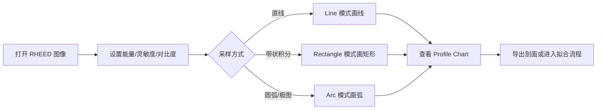
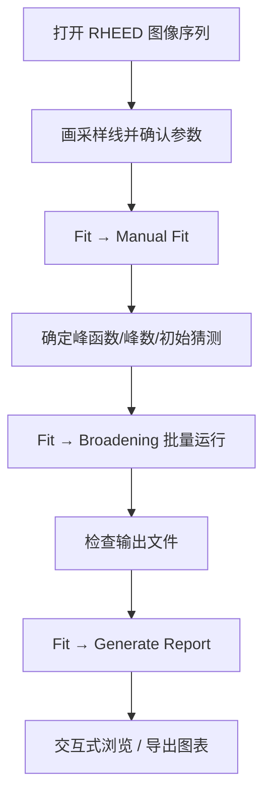
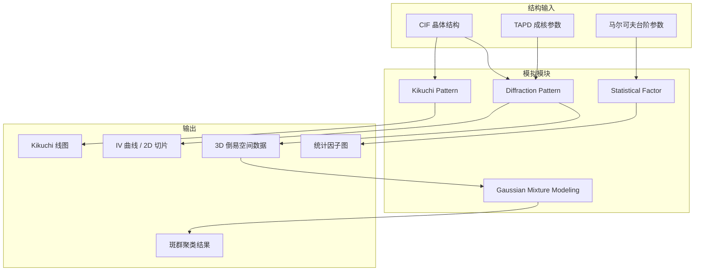

# PyRHEED 详细使用教程与工作流

Language links: [English](TUTORIAL_en.md) | [中文](TUTORIAL_zh.md)

本文档介绍 PyRHEED 的界面布局、典型分析流程、批处理场景配置以及理论模拟模块的使用方法。

---

## 目录

1. [快速上手](#1-快速上手)
2. [主界面概览](#2-主界面概览)
3. [工作流 A：实验 RHEED 图像分析](#3-工作流-a实验-rheed-图像分析)
4. [工作流 B：倒易空间映射（RSM）](#4-工作流-b倒易空间映射rsm)
5. [工作流 C：线剖面拟合与报告](#5-工作流-c线剖面拟合与报告)
6. [工作流 D：场景批处理（Scenario）](#6-工作流-d场景批处理scenario)
7. [工作流 E：理论模拟](#7-工作流-e理论模拟)
8. [配置文件说明](#8-配置文件说明)
9. [常见问题](#9-常见问题)

---

## 1. 快速上手

### 1.1 安装

```bash
# 安装 uv（若尚未安装）
# Windows (PowerShell):
powershell -ExecutionPolicy ByPass -c "irm https://astral.sh/uv/install.ps1 | iex"

# 克隆并安装依赖
git clone https://github.com/JMjimike/PyRHEED.git
cd PyRHEED
uv sync
```

### 1.2 启动

```bash
uv run src/main.py
```

程序以最大化窗口启动。首次使用建议先打开 **Preference → Default Settings**，确认电子能量、灵敏度等参数与您的 RHEED 仪器一致。

### 1.3 支持的图像格式

| 格式 | 说明 |
|------|------|
| RAW | 相机原始格式，通过 rawpy 读取，推荐用于高动态范围数据 |
| TIFF / PNG | 通用格式，适合 16 位灰度图 |
| JPEG | 仅 8 位，动态范围有限，不推荐用于定量分析 |

---

## 2. 主界面概览

### 2.1 菜单栏

| 菜单 | 功能 |
|------|------|
| **File → Open** | 打开 RHEED 图像 |
| **File → Export** | 导出 RHEED 图、线剖面（文本/图像/SVG） |
| **Preference → Default Settings** | 修改默认物理参数与显示设置 |
| **Mapping → Configuration** | 倒易空间映射配置 |
| **Mapping → 3D Surface** | 三维倒易空间曲面 |
| **Fit → Broadening** | 批量线剖面拟合（展宽分析） |
| **Fit → Manual Fit** | 手动拟合，初始化参数 |
| **Fit → Generate Report** | 生成拟合结果交互式报告 |
| **Fit → Gaussian Mixture Modeling** | 高斯混合模型分析 |
| **Simulation → Statistical Factor** | 统计因子模拟 |
| **Simulation → Diffraction Pattern** | 运动学衍射图样模拟 |
| **Simulation → Kikuchi Pattern** | Kikuchi 线模拟 |
| **Run → Run Scenario** | 打开场景批处理窗口 |

### 2.2 工具栏

| 工具 | 作用 |
|------|------|
| 打开 / 保存 | 加载图像、导出当前画布 |
| 线 (Line) | 沿直线提取强度剖面 |
| 矩形 (Rectangle) | 沿矩形区域积分提取剖面 |
| 弧 (Arc) | 沿圆弧提取剖面（用于极图/方位角扫描） |
| 平移 (Pan) | 拖动画布 |
| 缩放 +/- | 放大/缩小 |
| 适应画布 | 自动缩放至合适大小 |
| 深色/浅色模式 | 切换界面主题 |

### 2.3 右侧属性面板

可在面板中实时调整：

- **Sensitivity（灵敏度）**：像素 ↔ 倒易空间坐标的换算系数
- **Electron Energy（电子能量，keV）**
- **Azimuth（方位角）**
- **Brightness / Black Level**：图像对比度
- **Integral Half Width**：矩形/弧线积分的半宽
- **Chi Range / Radius / Tilt Angle**：RSM 与球面映射相关参数

修改后当前标签页中的图像与剖面会即时更新。

### 2.4 多标签页

每打开一张图像会新建一个标签页。可在不同样品或不同扫描序列之间切换，各标签页独立保留绘制图形与分析状态。

---

## 3. 工作流 A：实验 RHEED 图像分析

适用于：单张或少量 RHEED 图，需要快速查看衍射斑位置并提取线剖面。

```
打开图像 → 调整显示 → 绘制采样线 → 查看/导出剖面
```

### 步骤详解

**Step 1 — 打开图像**

- 菜单 **File → Open**，或工具栏「打开」按钮
- 选择 RAW / TIFF / PNG 等文件
- 图像自动转为灰度显示

**Step 2 — 调整显示参数**

- 在右侧属性面板调节 **Brightness**、**Black Level**，使衍射斑清晰可见
- 设置 **Electron Energy** 与 **Sensitivity**（需与实验标定一致）
- 可通过工具栏缩放、平移定位感兴趣区域

**Step 3 — 提取线剖面**

1. 点击工具栏 **Line**（线模式）
2. 在图像上点击起点，拖拽至终点，释放鼠标
3. 下方 **Profile Chart** 实时显示强度随位置（或倒易坐标）的变化
4. 若需沿带状区域积分，改用 **Rectangle** 模式并设置 **Integral Half Width**

**Step 4 — 导出结果**

- **File → Export → Line profile as text**：保存数值数据（后续可用于外部拟合）
- **File → Export → Line profile as image / SVG**：保存剖面图
- **File → Export → RHEED pattern as Image**：保存当前画布截图

### 工作流示意



---

## 4. 工作流 B：倒易空间映射（RSM）

适用于：一系列按方位角 φ 或倾斜角 χ 扫描的 RHEED 图像，需要构建二维/三维倒易空间图或极图。

```
准备图像序列 → Mapping 配置 → 生成 2D/3D 图 → 可选 ParaView 后处理
```

### 前置条件

- 同一目录下存放按序号命名的扫描图像（如 `0001.tif`, `0002.tif`, …）
- 已知每张图对应的方位角或倾斜角步长
- 已在主窗口属性面板中正确设置 **Sensitivity**、**Electron Energy**

### 步骤详解

**Step 1 — 打开任意一张序列图像**

先通过 **File → Open** 打开该目录中的任意一张图，使程序获知数据路径。

**Step 2 — 打开映射配置**

菜单 **Mapping → Configuration**

**Step 3 — 配置参数**

在映射对话框中设置：

| 参数 | 含义 |
|------|------|
| Source Directory | 图像序列所在文件夹 |
| Start / End Index | 参与映射的图像序号范围 |
| Range | 每张图提取剖面的倒易空间范围 |
| Normalization | 是否对强度归一化 |

根据扫描类型选择：

- **方位角扫描（φ-scan）**：沿圆弧（Arc 模式）或垂直方向提取，构建 `(K∥, φ)` 或 `(Kx, Ky)` 图
- **垂直扫描（χ-scan / IV）**：沿垂直方向提取，构建 `(K∥, K⊥)` 图

**Step 4 — 运行并查看**

- 点击运行，程序批量处理图像序列
- 生成二维倒易空间图；可通过 **Mapping → 3D Surface** 查看三维曲面
- 三维数据可导出为 **.vtp** 格式，在 ParaView 中打开进一步渲染

### 典型目录结构

```
my_rheed_scan/
├── 0000.tif    # φ = 0°
├── 0001.tif    # φ = 1°
├── 0002.tif    # φ = 2°
└── ...
```

---

## 5. 工作流 C：线剖面拟合与报告

适用于：需要从一系列 RHEED 图批量提取峰位、展宽（FWHM）等定量参数。

```
Manual Fit 初始化 → Broadening 批量拟合 → Generate Report 可视化
```

### 5.1 手动拟合（Manual Fit）

**目的**：在批量处理前，为峰形函数确定合理的初始猜测值。

1. 打开图像并在画布上画好采样线
2. 菜单 **Fit → Manual Fit**
3. 选择峰函数类型（Gaussian、Voigt 等）
4. 设置峰数量、背景选项
5. 交互式调整参数，观察拟合曲线与实验曲线的吻合程度
6. 确认后将参数作为 Broadening 模块的初始值

### 5.2 批量展宽拟合（Broadening）

1. 菜单 **Fit → Broadening**
2. 配置：
   - **Source Directory**：图像序列目录
   - **Start / End Index**：处理范围
   - **Number of Steps**：沿采样线方向平行扫描的步数（用于统计多条剖面）
   - **Fit Function**：Gaussian / Voigt 等
   - **Number of Peaks**：每道剖面的峰数
   - **Tolerance**（ftol, xtol, gtol）：拟合收敛阈值
3. 点击运行；进度条显示处理状态
4. 结果写入目标目录（默认与源目录相同），通常为文本或表格格式，包含峰位、强度、展宽等

### 5.3 生成报告（Generate Report）

1. 菜单 **Fit → Generate Report**
2. 选择 Broadening 输出的结果文件或目录
3. 程序生成交互式图表，可浏览各扫描角度的拟合结果
4. 支持导出图像，便于写入论文或报告

### 完整拟合工作流



---

## 6. 工作流 D：场景批处理（Scenario）

适用于：需要重复运行「衍射模拟 + TAPD 统计 + 展宽拟合 + 报告生成」等组合任务，无需逐步手动操作。

```
编辑 default_scenario.ini → Run Scenario → 自动输出到目标目录
```

### 6.1 打开场景窗口

菜单 **Run → Run Scenario**

窗口包含两个主要标签页：

| 标签页 | 功能 |
|--------|------|
| **CIF** | 从 CIF 结构文件模拟 RHEED 衍射（含 IV 曲线、多层结构） |
| **TAPD** | 平移反相畴（Translational Antiphase Domain）模型模拟与畴界统计 |

### 6.2 CIF 场景主要参数

| 参数 | 说明 |
|------|------|
| `cif_path` | 晶体结构 CIF 文件路径 |
| `destination` | 结果输出目录 |
| `h_range`, `k_range`, `l_range` | 倒易格子范围 |
| `shape` / `lateral_size` | 模拟区域形状与尺寸 |
| `z_min`, `z_max` | 垂直方向层厚范围（可逗号分隔多个值做 IV 扫描） |
| `number_of_k_para_steps` / `number_of_k_perp_steps` | 平行/垂直倒易空间采样步数 |
| `kx/ky/kz_range_min/max` | 倒易空间扫描范围 |
| `calculate_diffraction` | 是否计算衍射图样 |
| `save_iv_image` / `save_iv_data` | 是否保存 IV 图像与数据 |

### 6.3 TAPD 场景主要参数

| 参数 | 说明 |
|------|------|
| `epi_cif_path` / `sub_cif_path` | 外延层 / 衬底 CIF 文件 |
| `x_max`, `y_max` | 模拟平面尺寸（Å 或 nm，视配置而定） |
| `density` | 畴密度（可逗号分隔多个值做参数扫描） |
| `distribution` | 畴尺寸分布类型（如 `completely random`） |
| `save_size_distribution` | 保存畴尺寸分布 |
| `save_boundary_statistics` | 保存畴界统计 |
| `save_voronoi_diagram` | 保存 Voronoi 图 |
| `calculate_diffraction` | 是否进一步计算衍射图样 |

### 6.4 运行场景

1. 在场景窗口中检查/修改各参数
2. 点击 **Choose Scenario** 可加载其他 `.ini` 场景文件
3. 点击 **Save Scenario** 或 **Save As Default** 保存配置
4. 点击 **Run Current Scenario** 开始批处理
5. 输出目录默认为 `src/RHEED scenario MMDDYYYY/`（按日期命名）

### 6.5 典型批处理输出

以 TAPD 多密度扫描为例，输出目录可能包含：

```
RHEED scenario 02212021/
├── 0.001-70.0nm/
│   └── 0.001.txt          # 畴界统计数据
├── 0.002-70.0nm/
│   └── 0.002.txt
└── ...
```

后续可将这些结果导入 **Broadening** 或 **Generate Report** 模块继续分析。

---

## 7. 工作流 E：理论模拟（详细）

工作流 E 覆盖 PyRHEED 中所有**不依赖实验图像**的理论计算模块。它们从主窗口菜单 **Simulation** 或 **Fit** 独立启动，可用于预测衍射图样、解释表面粗糙度效应、标定晶体取向，或对模拟/实验数据进行聚类分析。

### 7.0 模块总览

| 模块 | 菜单入口 | 物理模型 | 典型输入 | 典型输出 |
|------|----------|----------|----------|----------|
| 衍射图样模拟 | Simulation → Diffraction Pattern | 运动学电子衍射 | CIF 结构文件 | 3D 倒易空间强度、IV 曲线、.vtp |
| TAPD 畴模型 | 同上（TAPD 标签页） | 平移反相畴随机成核 | 衬底/外延层 CIF | Voronoi 图、畴界统计、衍射图 |
| 统计因子 | Simulation → Statistical Factor | 六方表面马尔可夫台阶 | η, ε, 不对称比 | 3D 统计因子曲面、2D 等高线 |
| Kikuchi 图样 | Simulation → Kikuchi Pattern | 动力学电子散射（简化） | CIF + 带轴 | Kikuchi 线、Laue 斑、倒易斑 |
| 高斯混合模型 | Fit → Gaussian Mixture Modeling | 贝叶斯 GMM 聚类 | 3D 倒易空间 CSV | 衍射斑分组、权重分布 |
| TAPD 一维/二维剖面 | 独立脚本 `translational_antiphase_domain.py` | 解析 TAPD 强度公式 | γ（畴尺寸参数） | 1D 剖面、2D 强度图 |



---

### 7.1 衍射图样模拟（Diffraction Pattern）

**入口：** 主菜单 **Simulation → Diffraction Pattern**

这是 PyRHEED 最核心的理论模块，窗口标题为 **「RHEED Simulation」**。左侧为控制面板，右侧为三维散点/曲面视图，用于显示倒易空间中的衍射强度分布。

#### 7.1.1 两种结构构建模式

控制面板顶部的 **CIF / TAPD** 标签页决定结构来源：

**模式 A — 纯 CIF 堆叠（CIF 标签页）**

适用于：已知晶体结构、多层薄膜堆叠、简单外延体系。

1. 在文件浏览器中定位 CIF 文件，双击或点击 **Add CIF**
2. 每添加一个 CIF，会在下方 **Sample** 标签页中新建一层结构
3. 每层可独立设置：

| 参数 | 含义 |
|------|------|
| h / k / l range | 沿各晶向复制的晶胞数 |
| Shape | 模拟区域形状：Triangle / Square / Hexagon / Circle |
| Lateral Size | 横向尺寸（nm） |
| X/Y/Z Shift | 层间平移（Å） |
| rotation | 绕 c 轴旋转（°） |
| Z range | 垂直方向截断范围（Å） |

4. 可添加多个 CIF 标签页，模拟「衬底 + 缓冲层 + 外延层」等异质结构
5. 点击各层参数旁的 **Apply** 更新实空间原子模型（右侧 3D 视图）

**模式 B — TAPD 随机畴模型（TAPD 标签页）**

适用于：外延层存在平移反相畴（如 MoS₂/Sapphire 等 2D 材料外延），需要模拟畴尺寸分布对衍射的影响。参考论文：Lu et al., Surface Science (1981)。

1. **Add Substrate** / **Add Epilayer**：分别加载衬底与外延层 CIF
2. 设置取向：**Substrate orientation** / **Epilayer orientation**（(001)、(010)、(100)、(111)）
3. 设置模拟区域尺寸：**X_max**, **Y_max**（Å），**Z_min**, **Z_max**（c 方向晶胞层数）
4. 设置层间位移：**X/Y/Z Shift**（外延层），**Buffer X/Y/Z Shift**（缓冲层）
5. 配置成核统计：

| 参数 | 说明 |
|------|------|
| Epilayer nucleation distribution | 畴成核分布：`completely random` / `geometric` / `delta` / `binomial` / `uniform` |
| Density | 畴密度（random 模式下为每单位面积畴数） |
| Add buffer layer | 是否在衬底-外延层之间插入缓冲原子层 |
| Buffer atom | 缓冲层元素（如 S） |
| Buffer in-plane / out-of-plane distribution | 缓冲层原子面内/面外分布 |

6. 点击 **Add Structure** 生成随机畴结构（耗时与 X_max × Y_max × density 成正比）
7. 生成后可查看：
   - **Plot Size Distribution**：畴尺寸分布直方图
   - **Plot Boundary Statistics**：畴界长度统计
   - **Plot Boundary**：畴界位置图
   - **Plot Voronoi Diagram**：Voronoi  tessellation 图

#### 7.1.2 倒易空间扫描（Detector 标签页）

结构就绪后，切换到 **Detector** 标签页配置「虚拟探测器」扫描范围：

| 参数 | 含义 |
|------|------|
| Number of K_para Steps | Kx–Ky 平面（平行表面方向）采样点数 |
| Number of K_perp Steps | Kz（垂直表面方向）采样点数 |
| Kx / Ky / Kz range | 各方向倒易空间范围（Å⁻¹） |
| Symmetric（勾选框） | 锁定 Kx/Ky 对称扫描（± 相同） |

典型设置示例：

- **静止 RHEED 斑（2D 图）**：K_para = 50~500，K_perp = 1，Kz range = 0
- **IV 曲线（振荡曲线）**：K_para = 1，K_perp = 500~1000，Kz range = 0~10
- **3D 倒易空间体**：K_para = 50，K_perp = 50，三方向均有范围

点击 **Start Calculation** 开始运动学衍射计算。计算基于 Peng 1996/1998 电子原子散射因子（`files/peng_high.json`、`files/peng_ionic.json`，\(f_e(s)=\sum a_i e^{-b_i s^2}\)，\(s=|Q|/(4\pi)\)）和结构因子叠加；可选 **Use constant atomic structure factor** 加速计算。

> **GPU 加速：** 若安装了 PyCUDA，**GPU** 标签页中可启用 GPU 计算，大幅缩短大网格扫描时间。

#### 7.1.3 结果查看与导出（Plot Options）

计算完成后：

| 按钮 | 功能 |
|------|------|
| Show XY Slices | 固定 Kz，显示 Kx–Ky 截面（类似 RHEED 花样） |
| Show XZ Slices | 固定 Ky，显示 Kx–Kz 截面（IV 型） |
| Show YZ Slices | 固定 Kx，显示 Ky–Kz 截面 |
| Save the data | 保存三维强度数组 |
| Save the FFT | 对 IV 曲线做 FFT，得到层厚信息 |
| Load data | 重新加载已保存的计算结果 |

**Plot Options** 附加选项：

- **Show FWHM Contour**：叠加半高宽等高线
- **Plot in logarithmic scale**：对数强度显示
- **Do FFT for the IV curve**：对 IV 扫描结果做快速傅里叶变换
- **Colormap**：选择 matplotlib 色图（默认 viridis）

**保存：**

- **Save Destination** 区域设置输出目录与文件名
- **Save Scene** 导出当前 3D 视图截图
- 三维数据可导出为 **.vtp**，在 ParaView 中打开

#### 7.1.4 典型操作示例：MoS₂ 外延层 IV 曲线

```
1. CIF 标签页 → Add CIF → 选择 MoS2.cif
2. 设置 h/k/l range = 3/3/1，Shape = Circle，Lateral Size = 3 nm
3. Z range 设为多层（如 1~21 Å 范围内多个 z_min 值）或单次扫描
4. Detector → K_para Steps = 1，K_perp Steps = 1000
5. Kx/Ky range = 0（固定平行分量），Kz range = 0~10 Å⁻¹
6. Start Calculation
7. Show XZ Slices → 查看 IV 振荡
8. 勾选 Do FFT → Save the FFT → 读取层厚振荡周期
```

#### 7.1.5 典型操作示例：TAPD 畴密度对衍射的影响

```
1. TAPD 标签页 → 加载 Sapphire（衬底）+ MoS2（外延层）CIF
2. X_max = Y_max = 350 Å，Density = 0.01
3. Add Structure → 等待 Voronoi 结构生成
4. Plot Boundary Statistics → 查看畴界统计
5. Detector → 设置 Kx/Ky = ±3 Å⁻¹，K_perp = 1
6. Start Calculation → Show XY Slices
7. 改变 Density，重复步骤 3~6，对比衍射斑展宽变化
```

---

### 7.2 统计因子模拟（Statistical Factor）

**入口：** 主菜单 **Simulation → Statistical Factor**

该模块实现 Spadacini 等人提出的**六方表面台阶密度马尔可夫模型**，用于模拟表面粗糙度（台阶）对 RHEED 衍射斑形状的影响，**不需要 CIF 文件**。

#### 7.2.1 物理背景

在理想光滑表面上，RHEED 衍射斑为 sharp spot；当表面存在台阶（terrace-step 结构）时，衍射斑沿垂直方向展宽。统计因子 \(S(u,v)\) 描述这种展宽效应，其中：

- **η (eta)**：马尔可夫转移参数，与台阶概率相关（0~π）
- **ε (epsilon)**：台阶原子密度参数（0~200，界面中为相对量）
- **Step Atom Density Asymmetric Ratio**：台阶原子密度不对称比（100~500），描述不同晶向台阶密度差异
- **R**：由 ε 和 η 计算得到的有效参数，显示在界面上

#### 7.2.2 操作步骤

1. 打开模块后，右侧 **Options** 面板调节参数：

| 参数 | 建议起始值 | 说明 |
|------|-----------|------|
| η (π) | 0.5~1.0 | 增大 → 台阶关联性增强 |
| ε | 0.01~1.0 | 台阶密度相关量 |
| Asymmetric Ratio | 100~300 | 100 = 完全对称 |
| x range / z range | 10~400 | 倒易空间显示范围 |
| x step / z step | 0.1~10 | 采样步长（越小越精细，越慢） |
| Lattice Constant | 3.15 | 晶格常数（Å），如 MoS₂ |
| Choose Unit | Brillouin Zone % 或 Å⁻¹ | 横轴单位 |

2. 点击 **Apply**，左侧 3D 曲面显示统计因子 \(S(K_x, K_y)\)
3. 调节 **Theme** 改变 3D 配色；**Appearance** 中调整字体
4. 点击 **Show 2D Contour** 弹出 matplotlib 二维等高线图（对数色标，viridis）
5. 在 3D 视图中可旋转、缩放，观察衍射斑展宽各向异性

#### 7.2.3 参数扫描建议

```
固定 η = 0.8，扫描 ε = 0.01, 0.05, 0.1, 0.5
→ 观察衍射斑沿 Kz 方向展宽如何随台阶密度增加

固定 ε = 0.1，扫描 η = 0, 0.5π, π
→ 观察台阶关联性对斑形状的影响

固定 ε, η，改变 Asymmetric Ratio = 100 vs 300
→ 观察六方对称性破缺导致的各向异性展宽
```

#### 7.2.4 与实验对比

1. 从实验 RHEED 图提取线剖面（工作流 A/C），测量 FWHM
2. 在统计因子模块中调节 η、ε，使 2D 等高线的等强度线形状与实验斑匹配
3. 拟合得到的 η、ε 可反推表面台阶密度与关联长度

---

### 7.3 Kikuchi 图样模拟（Kikuchi Pattern）

**入口：** 主菜单 **Simulation → Kikuchi Pattern**

模拟**非重构单晶表面**的 Kikuchi 线、Kikuchi 带包络线、倒易斑点和 Laue 斑点，用于晶体取向标定和指数化。

#### 7.3.1 操作步骤

1. **Add CIF** → 选择晶体结构文件，晶格常数自动填入
2. 在 **Experimental Parameters** 中设置：

| 参数 | 典型值 | 说明 |
|------|--------|------|
| Zone axis (h k l) | 1 1 0 | 入射束近似平行方向 |
| Out-of-plane axis (h k l) | 0 0 1 | 表面法向参考 |
| Electron energy | 15~30 keV | 与 RHEED 仪器一致 |
| Incident angle | 1~5° | 掠入射角 |
| Inner potential | ~17 eV | 晶体内势（影响折射） |

3. **Simulation Options**：

| 参数 | 说明 |
|------|------|
| Index maximum | 倒易矢量截断（hkl 最大值，如 10） |
| Plot range k_x / k_y | 绘图范围（Å⁻¹ 量级） |
| 颜色设置 | Reciprocal spot / Kikuchi line / Envelope / Laue spot 各自配色 |

4. 点击 **OK** 开始计算（后台线程，进度条显示）
5. 右侧图表显示：
   - **Reciprocal spots**（黑色）：倒易点
   - **Kikuchi lines**（绿色）：Kikuchi 线
   - **Kikuchi envelope**（红色）：Kikuchi 带包络
   - **Laue spots**（蓝色）：Laue 斑点

#### 7.3.2 使用技巧

- 若 Kikuchi 线不完整，增大 **Index maximum** 或 **Plot range**
- 修改 **Zone axis** 可模拟不同晶带轴下的图样，用于取向旋转分析
- 勾选 **Show axes / Show grid** 辅助读数
- 点击 **Abort** 可中断长时间计算

#### 7.3.3 典型场景

```
问题：已知 Si(001) 衬底，RHEED 图中有 Kikuchi 线，需确认带轴

步骤：
1. 加载 Si.cif
2. Zone axis = 1 1 0，Out-of-plane = 0 0 1
3. Electron energy = 20 keV，Incident angle = 3°
4. 运行模拟，与实验 RHEED 图叠加对比
5. 调整 Zone axis 直至 Kikuchi 线位置匹配
```

---

### 7.4 高斯混合模型（Gaussian Mixture Modeling）

**入口：** 主菜单 **Fit → Gaussian Mixture Modeling**

> 注：GMM 位于 **Fit** 菜单而非 Simulation，但常用于分析**模拟或实验产生的 3D 倒易空间数据**，故归入工作流 E。

该模块使用 **Bayesian Gaussian Mixture Model（BGMM）** 对倒易空间中的衍射斑进行无监督聚类，自动识别斑的位置、数量和相对强度权重。

#### 7.4.1 输入数据格式

需要 CSV 文件，至少包含三列：

| 列名 | 含义 |
|------|------|
| x | Kx 坐标 |
| y | Ky 坐标 |
| z | Kz 坐标（层索引或垂直倒易分量） |
| intensity | 该点强度（用于加权采样） |

典型来源：Diffraction Pattern 模块导出的 3D 数据，或 Reciprocal Space Mapping 模块的输出。

#### 7.4.2 操作步骤

1. **Source Directory → Browse** 选择 CSV 文件
2. 点击 **Load** 加载数据，Information 面板显示数据统计
3. **Sample** 区域：

| 参数 | 说明 |
|------|------|
| Number of Samples | 从强度分布中抽取的样本点数 |
| Number of Draws | 重复抽样次数 |
| Number of Z Slices | 参与分析的 Z 层数 |
| Draw Z=0 / Plot Z=0 | 预览 z=0 层的抽样分布 |

4. **Parameters** 区域（核心拟合参数）：

| 参数 | 建议值 | 说明 |
|------|--------|------|
| Number of Features | 2 | 特征维度（x, y） |
| Number of Components | 10~19 | 最大高斯分量数（BGMM 会自动剪枝） |
| Convergence Threshold | 0.001 | EM 算法收敛阈值 |
| Covariance Reg. | 1e-6 | 协方差正则化 |
| EM Iterations | 1500 | 最大迭代次数 |
| Covariance Type | full | 协方差矩阵类型 |
| Initialization Method | kmeans | 初始化方式 |

5. **Mean Prior / Covariance Prior** 表格：可手动设置各分量的初始位置（默认已预填六方斑格局部坐标）
6. 点击 **OK** 运行 BGMM
7. 结果视图：
   - **Distribution Chart**：抽样点散点图
   - **Weight Chart**：各分量权重
   - **Cost Chart**：收敛代价函数

8. 勾选 **Save Results** 可导出 `.txt` 或 `.xlsx`

#### 7.4.3 典型场景

```
问题：模拟的 3D 倒易空间数据中有 19 个衍射斑，需自动识别各斑中心

步骤：
1. 从 Diffraction Pattern 导出 3D CSV
2. GMM → Load CSV
3. Number of Components = 19，Initialization = kmeans
4. Draw Z=0 预览抽样是否合理
5. OK 运行 → 查看 Weight Chart 确认有效分量数
6. 导出结果，与各 (hkl) 指数对比
```

---

### 7.5 TAPD 解析模型（独立模块）

**入口：** 命令行独立运行（不在主窗口菜单中）

```bash
uv run src/translational_antiphase_domain.py
```

该模块提供**平移反相畴模型的解析强度公式**（1D 和 2D），无需构建实空间原子结构，适合快速理解 γ（畴尺寸参数）对衍射峰形的影响。

#### 7.5.1 界面功能

- **Gamma 滑块**：调节 γ 参数（0~1000，对应畴平均尺寸）
- 拖动滑块实时更新 1D 强度剖面
- 启动时自动弹出 2D 强度等高线图（h-k 空间）

#### 7.5.2 与 Diffraction Pattern 模块的关系

| 对比项 | translational_antiphase_domain.py | simulate_RHEED TAPD |
|--------|-----------------------------------|---------------------|
| 方法 | 解析公式 | 实空间随机成核 + 结构因子 |
| 速度 | 极快（毫秒级） | 较慢（依赖区域尺寸） |
| 物理细节 | 简化均匀 γ | 可设具体成核分布、缓冲层 |
| 适用 | 快速参数趋势 | Publication 级定量对比 |

建议：**先用解析模块探索 γ 范围，再用 TAPD 标签页做精细模拟。**

---

### 7.6 工作流 E 组合策略

实际研究中，多个模拟模块常组合使用：

#### 策略 1：从结构到衍射斑展宽

```
CIF → Diffraction Pattern（理想衍射图）
     ↓
Statistical Factor（加入台阶展宽）
     ↓
与实验 RHEED 图对比 FWHM
```

#### 策略 2：APD 畴模型的完整分析链

```
TAPD 解析模型（估算 γ）
     ↓
Diffraction Pattern TAPD 标签页（实空间畴 + 衍射）
     ↓
GMM（自动识别各衍射斑）
     ↓
Broadening 拟合（若有实验数据，工作流 C）
```

#### 策略 3：晶体取向标定

```
Kikuchi Pattern（理论 Kikuchi 线）
     ↓
与实验 RHEED 图叠加
     ↓
确定 Zone axis → 用于 Diffraction Pattern 的取向设置
```

#### 策略 4：场景批处理（与工作流 D 联动）

对于需要扫描多个参数（如 TAPD density = 0.001~0.128）的情况：

```
编辑 default_scenario.ini（[CIF] 和 [TAPD] 节）
     ↓
Run → Run Scenario
     ↓
自动生成各密度下的畴统计 + 衍射数据
     ↓
GMM / Generate Report 批量后处理
```

---

### 7.7 工作流 E 常见问题

**Q：Diffraction Pattern 中 Start Calculation 按钮灰色？**

需先在 CIF 或 TAPD 标签页中添加结构并 Apply/Add Structure，确保实空间模型已构建。

**Q：计算非常慢？**

- 减小 K_para × K_perp 步数
- 勾选 **Use constant atomic structure factor**
- 若有 GPU，在 GPU 标签页启用 CUDA 加速
- TAPD 模式减小 X_max × Y_max 或降低 density

**Q：IV 曲线看不到振荡？**

- 确认 K_perp Steps ≥ 500，Kz range 足够大
- 检查 Z range 是否覆盖多个层厚
- 勾选 **Do FFT for the IV curve** 后在频域查看

**Q：Statistical Factor 3D 图全平？**

- 增大 ε（台阶密度）或减小 η
- 缩小 x step / z step 提高分辨率
- 确认已点击 **Apply**

**Q：Kikuchi 模拟与实验不符？**

- 检查 Zone axis 和 Incident angle
- 调整 Inner potential（对折射敏感）
- 增大 Index maximum

**Q：GMM 分量数远少于预期？**

- 增大 Number of Components
- 检查 CSV 中 intensity 列是否正确
- 尝试 Initialization Method = kmeans
- 在 Mean Prior 表格中手动设置接近真实斑位置的初始值

---

## 8. 配置文件说明

### 8.1 `src/configuration.ini`

程序默认物理与显示参数，通过 **Preference → Default Settings** 修改。

主要段落：

| 段落 | 内容 |
|------|------|
| `[windowDefault]` | 窗口初始能量、方位角、积分宽度等 |
| `[propertiesDefault]` | 属性面板默认值（灵敏度、亮度范围等） |
| `[canvasDefault]` | 画布缩放、显示范围 |
| `[chartDefault]` | 图表主题 |

### 8.2 `src/default_scenario.ini`

场景批处理的默认配置，包含 `[CIF]` 与 `[TAPD]` 两节。可通过 **Run Scenario** 窗口编辑并另存。

修改场景前建议复制一份，避免覆盖默认配置：

```bash
cp src/default_scenario.ini my_experiment.ini
```

---

## 9. 常见问题

### Q1：图像打开后全黑或全白？

调节右侧 **Brightness** 和 **Black Level**。RAW 文件可能需要等待 rawpy 解码，大文件加载较慢属正常现象。

### Q2：线剖面的横轴单位不对？

检查 **Sensitivity** 是否与仪器标定一致。该参数将像素坐标转换为倒易空间坐标（单位通常为 Å⁻¹ 或 nm⁻¹，取决于标定方式）。

### Q3：Broadening 拟合不收敛？

1. 先用 **Manual Fit** 获得更好的初始猜测
2. 减小峰数量或放宽 bounds
3. 增大 `ftol` / `xtol` / `gtol` 容忍度
4. 确认采样线穿过衍射斑中心

### Q4：场景运行时 CIF 路径报错？

`default_scenario.ini` 中的路径为作者本地路径，使用前必须改为本机 CIF 文件路径，并设置有效的 `destination` 输出目录。

### Q5：三维 .vtp 文件如何查看？

1. 安装 [ParaView](https://www.paraview.org)
2. File → Open，选择导出的 `.vtp` 文件
3. 在 Properties 面板中选择合适的颜色映射

### Q6：如何在 Windows 上快速启动？

可在项目根目录创建快捷脚本 `run.bat`：

```bat
@echo off
cd /d %~dp0
uv run src/main.py
```

---

## 附录：推荐分析路线对照表

| 研究目标 | 推荐工作流 | 关键菜单 |
|----------|-----------|----------|
| 查看单张 RHEED 图、测量斑间距 | 工作流 A | File, 工具栏 Line |
| 构建 φ-scan / χ-scan 倒易空间图 | 工作流 B | Mapping → Configuration |
| 批量提取峰宽、峰位 | 工作流 C | Fit → Manual Fit → Broadening |
| 可视化拟合结果 | 工作流 C | Fit → Generate Report |
| 模拟外延层衍射图样 | 工作流 E | Simulation → Diffraction Pattern |
| 畴密度/畴界统计 + 衍射 | 工作流 D + E | Run → Run Scenario |
| 表面台阶统计因子 | 工作流 E | Simulation → Statistical Factor |

---

如有疑问，请联系：yux1991@gmail.com
